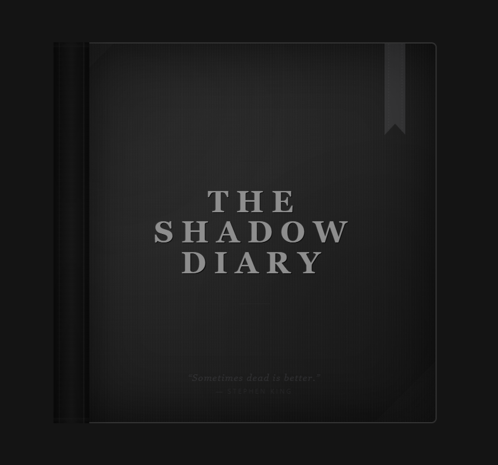

# 🌑 The Shadow Diary

<div align="center">

**A hyper-realistic digital diary application that bridges the gap between physical journaling and digital persistence.**

[](https://nextjs.org/)
[](https://reactjs.org/)
[](https://www.typescriptlang.org/)
[](https://tailwindcss.com/)
[](https://www.radix-ui.com/)

<br />
<br />


</div>

---

## 📖 About

**The Shadow Diary** aims to deliver the most immersive digital writing experience possible. Unlike standard note-taking apps, it recreates the tactile feeling of a physical book—complete with weight, texture, and fluid animation—while offering the advantages of digital storage.

> **Current State:** The project has recently undergone a major UI/UX overhaul to implement "schemeless" interaction and realistic book physics. The original AI psychoanalysis features ("The Shadow") are currently being re-integrated into this new interface.

---

## ✨ Features

### � **Realistic Book Simulation**
- **Two-Page Spread:** View your diary just like a real book, with a spiral binding and realistic shadows.
- **Natural Interaction:** 
  - **Click-to-Turn:** Simply click the outer edges of the pages to turn them. No buttons required.
  - **Seamless Cover:** The cover is fully integrated; click it to flip the book open smoothly.
  - **Content Focus:** Click anywhere on the lined paper to focus the writing area without triggering page turns.

### 🤫 **Schemeless UI**
- **Distraction-Free:** Navigation controls are hidden by default to immersive you in the writing experience.
- **Hover Reveal:** Access settings, import/export tools, and navigation shortcuts by simply moving your mouse to the top of the screen.
- **Dynamic Centering:** The book automatically centers itself on screen depending on whether it is open or closed.

### 💾 **Data Persistence**
- **Local Storage:** All entries are saved locally to your device immediately as you type.
- **Import/Export:** Full control over your data with JSON export and import functionality.
- **Page Management:** Unlimited pages, automatically created as you write.

---

## 🚧 Roadmap & AI Integration

The core concept of "The Shadow"—an AI persona that analyzes your entries using Jungian psychology—is the next phase of integration for the new book UI.

- [x] **Phase 1: Visual Physics** (Completed)
  - [x] 3D Page Turning (Sheet flipping)
  - [x] Interactive Click Zones
  - [x] Schemeless Navigation
- [x] **Phase 2: The Shadow Copilot** (Completed)
  - [x] Autonomous "Haunted Editor" (ContentEditable)
  - [x] Inline Ghost Text Completion (VS Code style)
  - [x] Instant Inference (Gemini Flash)
- [ ] **Phase 3: Future Hauntings** (Planned)
  - [x] **Audio Immersion**: Mechanical typewriter sounds and optional muted experience.
  - [ ] **Desktop Application**: Future plan to package the diary as a standalone Electron/Tauri app for native OS integration and offline dominance.
  - [ ] **Stand Alone LLM Support**: Future plan to support standalone LLMs for offline use.

---

## 🛠️ Tech Stack

### Frontend Core
- **Next.js 15** (App Router, Turbopack)
- **React 19**
- **TypeScript**
- **Tailwind CSS**

### UI & Animation
- **Radix UI** (Dialogs, Dropdowns, Toast)
- **Lucide React** (Icons)
- **CSS 3D Transforms** (Custom page turn engine)

### AI & Backend (Pending Re-integration)
- **Firebase Genkit**
- **Google Generative AI (Gemini)**

---

## 🚀 Getting Started

### Prerequisites
- Node.js (v20+)
- npm

### Installation

1. **Clone the repository**
   ```bash
   git clone https://github.com/yourusername/the-shadow-diary.git
   cd the-shadow-diary
   ```

2. **Install dependencies**
   ```bash
   npm install
   ```

3. **Run the development server**
   ```bash
   npm run dev
   ```

4. **Start Writing**
   Navigate to `http://localhost:9002` to open your diary.

---

## 📄 License

This project is licensed under the MIT License.